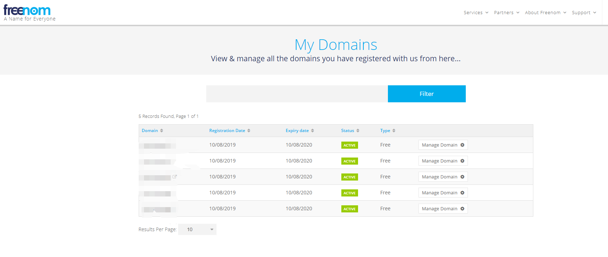
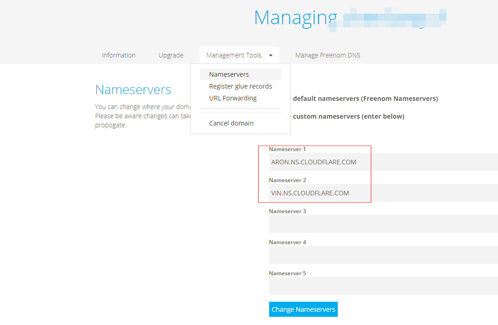

# v2ray-websocket-nginx-cloudflare-CDN

一个v2ray+websocket+nginx+cloudflare CDN的简单教程,大概是目前最安全的科学上网方式吧

### 第一步整个机器
这个就不用多说了,买个就是了,不知道在哪买可以上[主机百科](https://www.zhujiwiki.com)随便挑一个
最好有一点点linux使用基础.建议使用xshell连接SSH,配合xftp直接本地编辑好文件然后传上去,命令行编辑文件感觉不太爽

### 第二步申请域名
可以买一个,也可以[在freenom免费申请一个](https://www.freenom.com),申请完成后应看到这样的图

### 第三步申请cloudflare账号
申请的时候会给一串nameServer地址,进入freenom的管理后台填上去就行
到这里就把DNS交给cloudflare管理了

### 第四步 安装配置v2ray
在ubuntu16测试通过  
- bash <(curl -L -s https://install.direct/go.sh)   安装v2ray
- 生成证书,可以参考[这里](https://guide.v2fly.org/advanced/tls.html#%E8%AF%81%E4%B9%A6%E7%94%9F%E6%88%90),下文假设你通过这个指南成功的安装了证书
并且放到了指定位置
- 安装nginx
    - apt install nginx
- 复制粘贴小小的修改几个配置文件即可
    - 把[这个文件](./assets/服务端配置文件.json)内容直接替换 `/etc/v2ray`下的config.json的内容,服务端的配置文件就解决了
    - 然后处理nginx的配置文件,直接把[这个文件]的内容替换掉 `/etc/nginx/sites-available/default`这个文件的内容,此时要确定下输入https加域名能跑得起来才行.
    - 客户端的配置文件稍微麻烦一点,windows可以选择用[v2rayN](https://github.com/2dust/v2rayN),去release页面下载
    安卓可以用[v2rayNG](https://github.com/2dust/v2rayNG),配置文件里把域名换成自己的  然后导入到软件里
- systemctl restart nginx 
- systemctl restart v2ray 
- 然后可以尝试连接一下,不出意外应该可以了 *没错就是这么快!*

### 在cloudflare页面把云朵打勾即可

### 安装BBR加速
bbr脚本在[这里](https://github.com/chiakge/Linux-NetSpeed),建议装BBR PLUS,用着还行

    